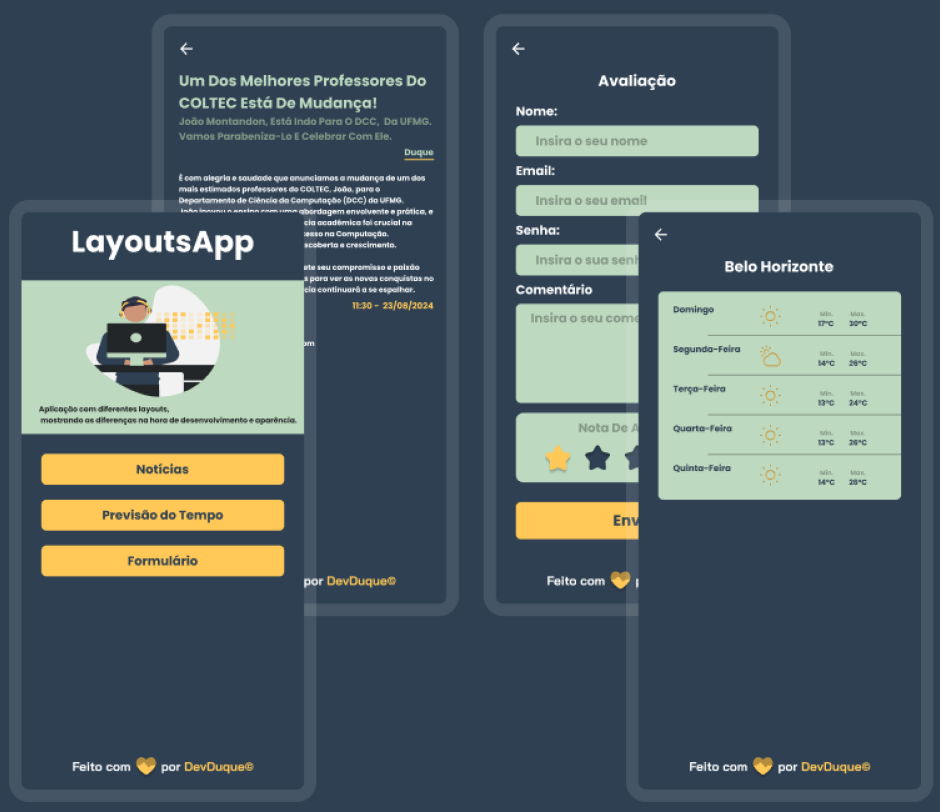

<h1 align="center">LayoutsApp</h1>

O projeto LayoutsApp demonstra o uso de diferentes layouts no desenvolvimento de aplicativos Android usando Java e XML. Ele oferece exemplos práticos e comparações entre quatro tipos de layouts comuns no Android: 
LinearLayout, ConstraintLayout, RelativeLayout e TableLayout. 
Este projeto é ideal para desenvolvedores que desejam entender como utilizar esses layouts de forma eficaz para criar interfaces de usuário organizadas e responsivas. 

## Layouts e suas Diferenças

### 1. LinearLayout

O `LinearLayout` organiza os elementos em uma única linha ou coluna. Você pode escolher a orientação horizontal ou vertical. É fácil de usar, mas pode se tornar ineficiente para layouts complexos, pois todos os elementos são renderizados em sequência, um após o outro.

- **Vantagens**:
  - Simplicidade na organização de elementos em linha ou coluna.
  - Adequado para interfaces simples.

- **Desvantagens**:
  - Pode ser ineficiente para layouts mais complexos, resultando em aninhamentos profundos.

### 2. ConstraintLayout

O `ConstraintLayout` oferece um sistema avançado de restrições, permitindo posicionar e dimensionar widgets de maneira mais flexível e adaptável. É ideal para criar layouts complexos sem precisar aninhar múltiplos layouts.

- **Vantagens**:
  - Permite criar layouts complexos com menos aninhamento.
  - Melhor performance em layouts complexos.
  - Flexibilidade na criação de interfaces responsivas.

- **Desvantagens**:
  - Requer uma curva de aprendizado maior.
  - Mais complexo de configurar corretamente comparado ao `LinearLayout`.

### 3. RelativeLayout

O `RelativeLayout` permite que os elementos sejam posicionados em relação uns aos outros ou ao contêiner pai. Isso oferece uma flexibilidade moderada na organização de elementos.

- **Vantagens**:
  - Flexível para posicionar elementos relativamente uns aos outros.
  - Útil para layouts que necessitam de relações específicas entre os elementos.

- **Desvantagens**:
  - Pode resultar em layouts complexos e difíceis de manter.
  - Substituído em muitos casos pelo `ConstraintLayout`, que oferece mais controle.

### 4. TableLayout

O `TableLayout` organiza os elementos em uma grade, semelhante a uma tabela, onde você define linhas e colunas. Cada célula da tabela pode conter um único elemento.

- **Vantagens**:
  - Útil para criar layouts tabulares, como formulários.
  - Facilita o alinhamento de elementos em linhas e colunas.

- **Desvantagens**:
  - Menos flexível para layouts não tabulares.
  - Pode se tornar complicado quando usado para layouts que não seguem uma estrutura tabular simples.

